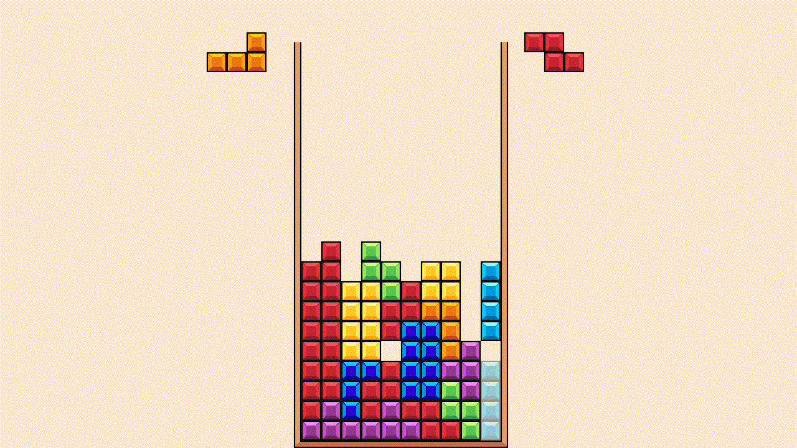
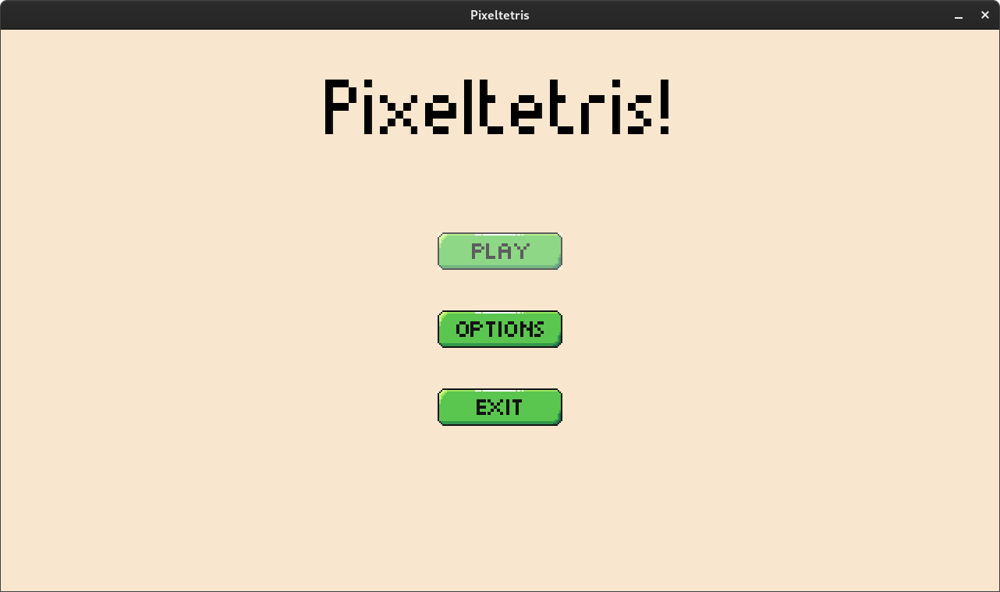
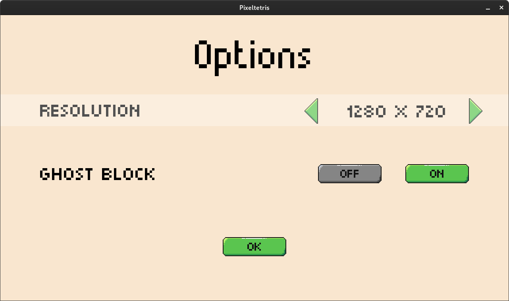
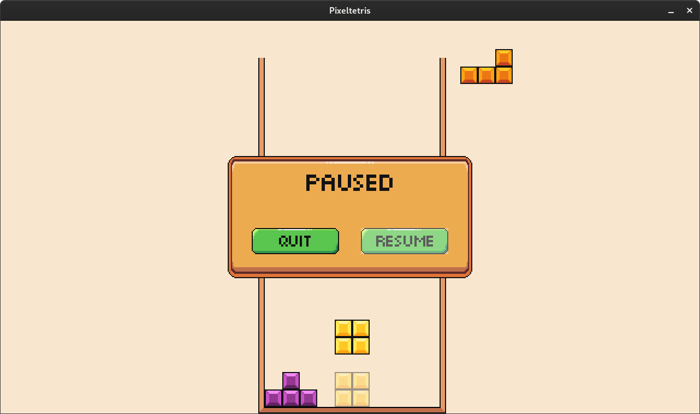

# Tetris
Тетрис был написан на C++ с применением библиотеки SDL2. Помимо основного геймплея в проекте таже были реализованы призрачные блоки для избежания постановкм тетромино не туда, простое меню и возможность выбрать несколько разрешений.



## Галерея 
  

## Установка 
- Для Windows вам, возможно, понадобится [Microsoft Visual C++ Redistributables](https://support.microsoft.com/en-us/topic/the-latest-supported-visual-c-downloads-2647da03-1eea-4433-9aff-95f26a218cc0), если он у вас уже не установлен.
- Для Linux вам нужно установить g++, SDL2, SDL2_ttf и SDL2_image runtime библиокети, которые легко можно найти в вашем пакетном менеджере. Для Debian-based систем используйте:
```
sudo apt install g++
sudo apt install libsdl2-2.0-0
sudo apt install libsdl2-ttf-2.0-0
sudo apt install libsdl2-image-2.0-0
```
## Инструкция по сборке
Для того чтобы собрать проект вам понадобится система сборки [CMake](https://cmake.org/overview/).

### Windows
- Первое что вам понядобится, это Visual Studio для того чтобы скомпилировать игру. Я компилировал игру на [Visual Studio Community](https://visualstudio.microsoft.com/vs/community/), но я уверен, что другипе версии тоже подойдут.
- Сколонируйте репозиторию на вашу машмну.
- Вам также понадобится [SDL2](https://www.libsdl.org/download-2.0.php), [SDL_ttf 2.0](https://www.libsdl.org/projects/SDL_ttf/) и [SDL_image 2.0](https://www.libsdl.org/projects/SDL_image/). Убедитесь, что вы скачали версию обозначенную "Visual C++". Извлеките все файлы из zip архива в корневую деректорию репозитории, которую вы скачали.
- Откройте папку проекта с помощью Visual Studio.
- Выберите CMakeLists.txt в корне проектка для того, чтобы скомпилировать проект.
- Вам возможно понадобится поменять *Build root* опцию в CMakeSettings.json с *${projectDir}\out\build\${name}* на *${projectDir}\build\${name}*, чтобы ширифты подгружались корректно.

### Linux
- Во первых, установите g++ компилятор используя CLI *sudo apt install g++* или *sudo dnf install gcc-g++*. Также установите CMake, используя CLI, *sudo apt install cmake* или *sudo dnf install cmake*.
- Вам также понядобятся SDL2, SDL_ttf и SDL_image библиотеки. Установить их можно на Debian-based системы запустив:
```
sudo apt install libsdl2-dev
sudo apt install libsdl2-ttf-dev
sudo apt install libsdl2-image-dev
```
или для Arch-based систем запустив:
```
sudo pacman -Ss SDL2-devel
sudo pacman -Ss SDL2_ttf-devel
sudo pacman -Ss SDL2_image-devel
```
- Сколонируйте репозиторию на ваш PC.
- Откройте терминалв корневой дериктории сколонированой репозитории и запустите эти команды одну за другой:
```
mkdir build
cmake -B build
cd build
make
```
Вы найдёте запускаемый файл в папке build.

## Управление 
- Левая/Правая/Нижнаяя стрелка клавиатуры: Двигает тетромино
- Стрелка вверх: Повернуть тетромино
- Space: Быстро поставить тетромино
- Shift/C: Поменяться с блоком в рюкзаке
- P: Пауза
- Q/Esc: Вернуться назад

## Литература и другие ресурсы
- [SDL2 framework](https://www.libsdl.org/) для всякой low-level ерунды
- [SDL_ttf 2.0](https://www.libsdl.org/projects/SDL_ttf/) для рендеригла шрифтов
- [SDL_image 2.0](https://www.libsdl.org/projects/SDL_image/) для загрузки изображений
- Шрифт называется [Munro](https://www.fontsquirrel.com/fonts/munro)
- [CMake scripts](https://github.com/tcbrindle/sdl2-cmake-scripts) для того чтобы найти SDL2, SDL_ttf, и SDL_image